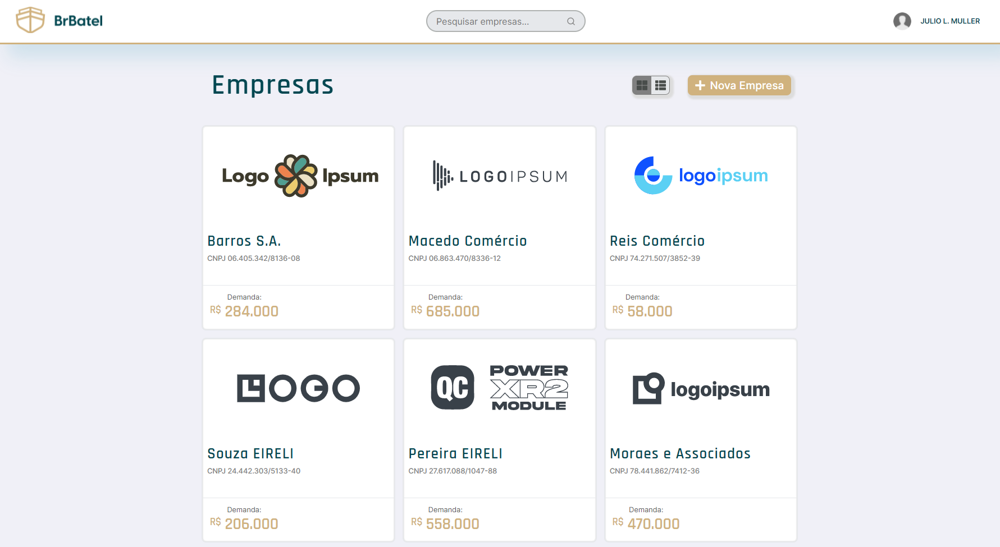

<h1 align="center">
  
</h1>

  

# Desafio Full-Stack

Essa aplicação foi desenvolvida como parte de um teste técnico para a vaga de Desenvolvedor Full Stack, com base [nestes requisitos](https://www.notion.so/BrBatel-Desafio-Full-Stack-f3368f5048c341a4967a82f009daf388).

Objetivos requisitados e cumpridos:

- [x] Cabeçalho com logo, dados do usuário e campo para pesquisa;
- [x] Tela para listar empresas em formato de grade/cards;
- [x] Tela para visualizar dados de uma empresa;
- [x] Tela para editar dados de uma empresa existente;
- [x] Tela para cadastrar nova empresa;
- [x] Recurso para excluir um registro;
- [x] API RESTful para operações de CRUD;

E, por conta de tempo, apenas um dos objetivos opcionais propostos foi atendido:
- [x] Alternar visualização do índice de empresas entre cards e lista;
- [ ] Implementar autenticação de usuário;

OBS: Optei por desenvolver o frontend com o framework Next, para ampliar o poder do React com SSR (Server-Side Rendering) e SSG (Static Site Generation).

## :hammer: Configurando o Ambiente

Para executar a aplicação, é necessário ter instalado na máquina o **Node v14**, **NPM v7** (ou **Yarn**) e uma versão do **PostgreSQL**. Apbra o projeto em um terminal de linha de comando e, na raíz do projeto, execute `npm install` ou `yarn`. O projeto utiliza *workspaces*, então **NPM v6** não vai instalar as dependências corretamente. Em seguida, configure as aplicações `server` e `web`:

### Backend:

1. Acesse a pasta com `cd server/`.
2. Atualize as variáveis de ambiente no arquivo `.env`  para refletir o seu ambiente e os dados para conexão com banco de dados.
3. Tenha certeza que você criou o database informado na variável de ambiente `TYPEORM_DATABASE`, caso contrário o servidor não vai conseguir iniciar.
4. Sincronize o banco de dados com o esquema de entidades através do comando `npm run db:sync:reset:seed`, que já populará as tabelas com dados para teste;
5. Execute o servidor com o comando `npm run dev`

### Frontend:

1. Acesse a pasta com `cd web/`.
2. Certifique-se de que a variável de ambiente `NEXT_PUBLIC_API_URL` reflete a URL onde o servidor está sendo executado.
3. Execute o servidor de desenvolvimento para a aplicação React/Next com `npm run dev`
