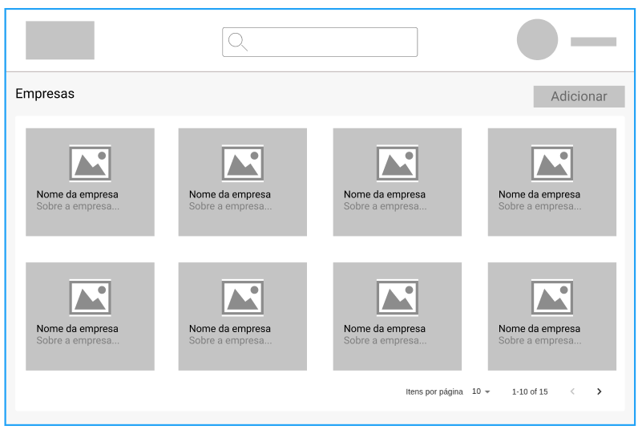

<h1 align="center">
  
</h1>

**Desafio Full-Stack** - Você foi designado para acrescentar uma nova *feature* na plataforma da BrBatel. Nesta atividade deve ser adicionado uma nova visualização do sistema para acesso de um determinado tipo de usuário.

Esta tela deverá ser composta por:

1. Header: Barra superior contendo a logo (lado esquerdo), um campo de pesquisa (centro) e as informações do usuário logado (lado direito).
2. Body:
   1. Campo contendo o título do body, chamado "Empresas"
   2. Botão para adicionar uma nova empresa.
   3. Lista de cards com as informações das empresas cadastradas no sistema e, ao clicar no card, deve ser aberto uma visualização detalhada das informações da empresa.

## Protótipo

O protótipo serve apenas como guia para o entendimento da necessidade, porém, ao implementar a aplicação, deve ser utilizado as cores e logo da BrBatel e estilizações conforme achar necessário. Na dúvida, mantenha algo simples e minimalista.

## Informações da Empresa

- Nome
- CNPJ: com a seguinte máscara XX.XXX.XXX/XXXX-XX.
- Demanda (R$): valor monetário, com a seguinte máscara Ex.: R$ 10.000.000,00.
- Faturamento Anual (dropdown):
  - Até R$ 10 milhões;
  - De R$ 10 a R$ 50 milhões;
  - De R$ 50 a R$ 200 milhões;
  - De R$ 200 a R$ 500 milhões;
  - Acima de R$ 500 milhões.
- Sobre: campo livre.

## Cores

## Objetivos Principais

### Back-End
[ ] Estruturar o projeto para implementação de uma API Rest.
[ ] Criar rotas de cadastro, atualização e exclusão da empresa.
[ ] Criar rota para listar as empresas e essa rota deve comportar pesquisa e paginação.
[ ] Criar rota para retornar a informação de uma empresa cadastrada baseado no ID dela (`/company/:id`).

### Front-End
[ ] Desenvolver os componentes necessários.
[ ] Construir o layout da aplicação.
[ ] Criar listagem em estrutura de cards
[ ] Possibilitar a paginação e a pesquisa dessa listagem utilizando a API.
[ ] Criar tela para o cadastro da empresa
[ ] Possibilitar a visualização detalhada da empresa ao clicar no card.
[ ] Utilizar a logo e cores da BrBatel (abaixo).

## Objetivos Opcionais

[ ] Adicionar autenticação na aplicação.
[ ] Criar outra forma de visualizar as empresas, ao invés de "cards", fazer em tabela.

## Tecnologias Obrigatórias

- React com Typescript (componente com funções e hooks)
- Node JS com Typescript (Express)
- TypeORM
- Postgresql
- Git

## Avaliação

- Pontos não detalhados na descrição podem ser implementados no formato que você julgar mais adequado.
- Na avaliação do projeto será considerado a qualidade e organização do código, a estrutura adotada, as escolhas de cores e estilizações aplicadas e o resultado final da aplicação rodando.
- Não é preciso disponibilizar a aplicação ou o banco em nenhuma plataforma ou serviço, todo o processo de avaliação sera feito local.

## Entrega

- Você deve disponibilizar a resolução do seu projeto em um repositório **privado** do Github.
- Adicionar o usuário murilodaluz como participante
- Encaminhar um e-mail em resposta informando a conclusão.
- Prazo para conclusão: **1 semana.**
